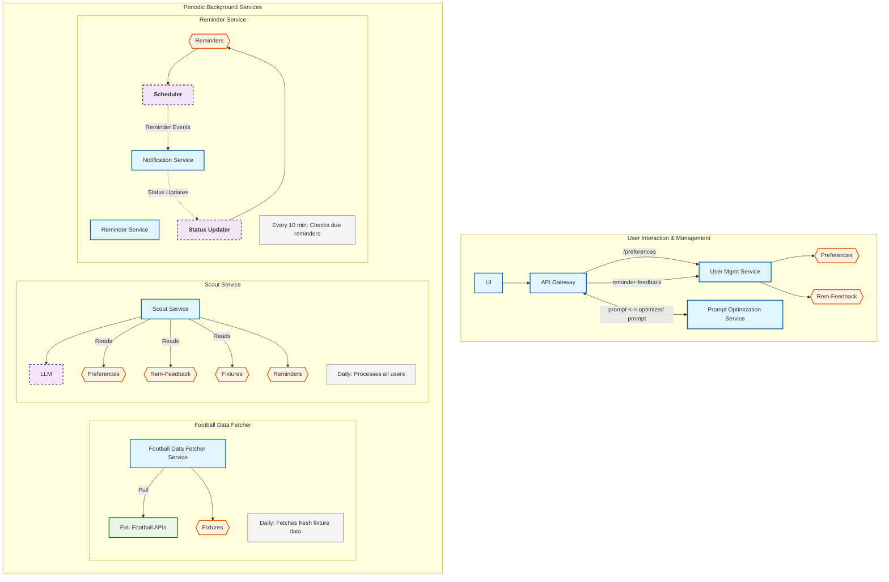
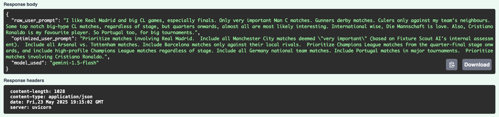

# Fixture Scout AI ⚽🤖

**Fixture Scout AI** is an AI-powered microservice platform that delivers personalized football match reminders to fans. By leveraging LLMs (Google Vertex AI Gemini), user preferences, and real-time football data, it ensures you never miss a match that matters to you. 🤍

---

## What is Fixture Scout AI? 🤔

Fixture Scout AI is a cloud-native, end-to-end system that:
- Lets users specify their football match interests in natural language 🗣️
- Optimizes these preferences using an LLM for precise match selection 🧠
- Fetches real-world football fixtures 📅
- Uses another LLM to select relevant matches and generate personalized reminders 📝
- Schedules and sends reminders via email or mock phone calls 📧📱
- Continuously improves through user feedback 🔄

---

## Architecture Diagram 🏗️

The Fixture Scout AI system is organized into three main functional domains, each handling specific aspects of the end-to-end workflow:

### System Overview



### Detailed Data Flow 🔍

1. **User Onboarding & Preferences (Top Section)**
   - User signs up via React web app with Firebase Auth 🔐
   - User enters football interests in natural language 📝
   - Prompt Optimization Service uses Gemini to refine user input ✨
   - User Management Service stores preferences and handles feedback 💾

2. **Data Processing & Match Selection (Middle Section)**
   - Football Data Fetcher Service runs daily to pull fixtures from external APIs 🌐
   - Scout Service runs periodically to process fixtures for all users 🏃‍♂️
   - Uses Gemini LLM to select relevant matches based on preferences and feedback 🧠
   - Generates personalized reminders with timing and custom messages ⏰

3. **Reminder Scheduling & Delivery (Bottom Section)**
   - Reminder Service schedules reminders and publishes to Pub/Sub 📤
   - Notification Service consumes Pub/Sub events and sends notifications 📬
   - Status updates flow back through the system for tracking 🔄

### Technology Stack 🛠️

- **Frontend**: React, Material UI, Firebase Auth
- **API Gateway**: Google Cloud Endpoints (ESPv2), OpenAPI
- **Backend Services**: Python FastAPI, Google Cloud Run
- **Database**: Firestore (NoSQL)
- **Message Queue**: Google Cloud Pub/Sub
- **LLM**: Google Vertex AI Gemini
- **Scheduling**: Google Cloud Scheduler
- **Authentication**: Firebase Authentication

---

## Microservice Descriptions 🧩

### User-Facing Services

- **Frontend (fixture-scout-ui):**  
  React + Material UI web application providing user interface for sign-up, preference management, reminder viewing, and feedback submission. Uses Firebase Authentication for user management. 🖥️

- **API Gateway:**  
  Google Cloud Endpoints (ESPv2) with OpenAPI specification that handles authentication via Firebase and routes requests to appropriate backend services. Provides a unified entry point for all API calls. 🌐

### Core Business Logic Services

- **User Management Service:**  
  Manages user profiles, preferences, and feedback. Handles user authentication validation, stores user data in Firestore, and provides endpoints for preference management and feedback collection. Triggers Scout Service processing when preferences are updated. 👤

- **Prompt Optimization Service:**  
  Uses Vertex AI Gemini to convert raw user preferences (natural language) into clear, structured prompts optimized for the Scout Service. **Designed for extensibility**: The LLM integration is abstracted, allowing easy switching to other LLM providers (OpenAI, Anthropic, etc.) by implementing the same interface. 📝✨

- **Scout Service:**  
  The core AI processing engine. Uses Vertex AI Gemini to analyze upcoming fixtures against user preferences and feedback history. Generates personalized reminders with importance scores, custom messages, and optimal timing. **LLM-agnostic design**: The service is built with a modular LLM client interface, making it easy to switch between different AI providers or models. 🤖

- **Football Data Fetcher Service:**  
  Fetches football fixture data from external APIs (supports Football-Data.org and mock data sources). **Extensible data source architecture**: Uses an interface (`IFootballDataSource`) that allows easy addition of new data providers (ESPN, API-Football, etc.) without changing the core service logic. **Football-Data.org Integration**: Fetches data from major competitions including Champions League (CL), Premier League (PL), Bundesliga (BL1), Ligue 1 (FL1), Serie A (SA), La Liga (PD), World Cup (WC), and European Championship (EC). Data includes match details, team information, competition metadata, and match status. Runs daily via Cloud Scheduler to ensure fresh fixture data is available for processing. ⚽📅

### Notification & Scheduling Services

- **Reminder Service:**  
  Dual-purpose service handling both scheduling and status management:
  - **Scheduler Component**: Checks for due reminders every 10 minutes, publishes notification events to Pub/Sub ⏲️
  - **Status Updater Component**: Processes status updates from notification delivery and updates Firestore 📊

- **Notification Service:**  
  Consumes Pub/Sub events and handles actual notification delivery. **Flexible notification system**: Uses an interface (`INotificationSender`) that currently implements mock email and phone call senders, with infrastructure ready for real notification providers (SendGrid, Twilio, etc.). New notification channels can be easily added by implementing the same interface. 📧📞

---

## How It Works: End-to-End Flow 🔄

### User Onboarding & Setup

1. **User Registration:**  
   User signs up via the React web app using Firebase Authentication. A user profile is automatically created in Firestore. 📝

2. **Preference Configuration:**  
   User enters football interests in natural language. The Prompt Optimization Service uses Gemini to convert this into a structured, actionable prompt optimized for match selection. ✨

   

### Data Processing Pipeline

3. **Fixture Data Collection:**  
   The Football Data Fetcher Service runs daily, pulling upcoming fixtures from external APIs (Football-Data.org or mock sources) and storing structured data in Firestore. 📅

4. **AI-Powered Match Selection:**  
   The Scout Service runs daily, processing all users. For each user, it:
   - Retrieves their optimized preferences and recent feedback
   - Analyzes upcoming fixtures using Vertex AI Gemini
   - Generates personalized reminders with importance scores, custom messages, and optimal timing
   - Stores reminder data in Firestore 🤖

### Notification & Delivery System

5. **Reminder Scheduling:**  
   The Reminder Service's Scheduler component runs every 10 minutes, checking for due reminders and publishing notification events to Pub/Sub. ⏰

6. **Notification Delivery:**  
   The Notification Service consumes Pub/Sub events and sends notifications via configured channels (currently mock email/phone, ready for real providers). 📬

7. **Status Tracking:**  
   The Reminder Service's Status Updater component processes delivery status updates from Pub/Sub and updates Firestore with final delivery status. 📊

### Continuous Improvement Loop

8. **User Feedback Integration:**  
   Users can provide feedback on reminders through the web app. This feedback is stored and used in future match selection to improve personalization and avoid unwanted matches. 💡

---

## Tech Stack + Services 🧰

- **Frontend:** React, Material UI, Firebase Auth, Vite
- **API Gateway:** Google Cloud Endpoints (ESPv2), OpenAPI
- **Backend:** Python (FastAPI), Google Cloud Run, Firestore, Pub/Sub
- **LLM:** Google Vertex AI Gemini (for both prompt optimization and match selection)
- **CI/CD & Infra:** Docker, gcloud, shell scripts

---

## Setup Instructions 🛠️

### Local Development

1. **Clone the repo:**  
   `git clone <repo-url> && cd fixture-scout-ai`

2. **Set up Python services:**  
   - Create and activate a virtualenv in each service directory.
   - Install dependencies: `pip install -r requirements.txt`
   - Set up required environment variables (see individual service directories for required configuration).

3. **Frontend:**  
   - `cd frontend/fixture-scout-ui`
   - `npm install`
   - `npm run dev`

4. **Emulators:**  
   - Use the scripts in `tools/emulator/` to run local Pub/Sub and Firestore emulators if needed.

### Deploy to Google Cloud ☁️

#### Prerequisites
- Google Cloud Project with billing enabled
- Required APIs enabled: Cloud Run, Firestore, Pub/Sub, Cloud Scheduler, Vertex AI, Artifact Registry
- Service account with appropriate IAM roles
- Docker installed locally

#### Service Deployment
Each service has a `cloud_run_deploy.sh` script. Example for the Scout Service:

```bash
cd scout_service
./cloud_run_deploy.sh
```

#### Infrastructure Setup
Use the scripts in `tools/gcp/` to set up the complete infrastructure:

1. **Service Accounts & Permissions:**
   ```bash
   cd tools/gcp
   ./create_cloud_scheduler_svc_acounts.sh
   ```

2. **Pub/Sub Topics & Subscriptions:**
   ```bash
   ./setup_pubsub_subscriptions.sh
   ```

3. **Cloud Scheduler Jobs:**
   ```bash
   ./setup_scheduler_jobs.sh
   ```

#### API Gateway Deployment
Deploy the API Gateway with OpenAPI specification:

```bash
cd api_gateway
./deploy_endpoints_svc_config.sh
```

#### Environment Configuration
Each service requires specific environment variables. See individual service directories for required configuration and environment variable setup.

### Production Considerations

- **Secrets Management**: Use Google Secret Manager for API keys and sensitive configuration 🔑
- **Monitoring**: Set up Cloud Monitoring and Logging for production observability 📈
- **Scaling**: Configure Cloud Run services with appropriate memory and CPU limits 📏
- **Security**: Enable VPC connector if needed for private network access 🔒

---

## LLM Integration & AI Processing 🤖

### Prompt Optimization Process
The Prompt Optimization Service uses Vertex AI Gemini to convert user's natural language preferences into structured, actionable prompts. This ensures that user intent is properly captured and formatted for optimal LLM processing in the Scout Service. 📝✨

### Scout Service AI Processing
The Scout Service constructs comprehensive prompts for Gemini that include:
- **Optimized user preferences** from the Prompt Optimization Service
- **Upcoming fixtures data** (structured JSON from Football Data Fetcher Service)
- **Recent user feedback** (negative feedback with reasons to avoid similar matches)
- **Context about user's historical preferences** and interaction patterns

### LLM Output Structure
Gemini returns a structured JSON response containing selected matches with:
- `fixture_id`: Unique identifier for the match
- `reason`: AI-generated explanation for why this match is relevant
- `importance_score`: Numerical score (1-5) indicating match relevance
- `reminder_triggers`: Detailed reminder configuration including:
  - Timing (when to send the reminder)
  - Mode (email or phone)
  - Custom message (personalized notification text)

### Feedback Integration & Learning
Users can provide feedback on reminders through the web interface:
- **Positive feedback**: Confirms good match selection 👍
- **Negative feedback**: Includes reasons why a match wasn't relevant 👎
- **Feedback storage**: All feedback is stored in Firestore with timestamps 🗃️
- **Learning loop**: Recent negative feedback is included in future LLM prompts to improve personalization and avoid similar unwanted matches 🔄

### AI Model Configuration
- **Model**: Google Vertex AI Gemini (latest available version)
- **Temperature**: Optimized for consistent, structured responses
- **Safety filters**: Configured to ensure appropriate content
- **Response format**: Structured JSON for reliable parsing
- **Extensibility**: The LLM integration is designed to be provider-agnostic, allowing easy switching to other AI providers (OpenAI, Anthropic, etc.) by implementing the same client interface

---

## Current Limitations & Future Enhancements 🚧

### Production Readiness Gaps
- **Notification Providers**: Currently uses mock email/phone call senders. Real integrations (SendGrid, Twilio, etc.) need to be implemented for production use.
- **Error Handling**: LLM response validation could be more robust; currently assumes Gemini returns valid JSON consistently.
- **Monitoring & Observability**: No comprehensive monitoring dashboard or alerting system for production deployment.

### Scalability Considerations
- **High-Volume Scenarios**: While Firestore and Pub/Sub are scalable, very high user/fixture volumes may require additional optimization and caching strategies.
- **Rate Limiting**: No rate limiting implemented for API endpoints.
- **Database Optimization**: Firestore queries could be optimized for large datasets.

### Feature Enhancements
- **Admin Dashboard**: No administrative interface for monitoring system health, user analytics, or manual operations.
- **Internationalization**: Only English is supported in prompts and user interface.
- **Advanced Analytics**: No user behavior analytics or system performance metrics.
- **Mobile App**: Web-only interface; no native mobile application.
- **Real-time Updates**: No WebSocket or real-time notification capabilities.

### Data & Integration
- **Football Data Sources**: Limited to Football-Data.org API; could expand to multiple data providers for better coverage.
- **Historical Data**: No long-term storage of historical fixtures or user interaction data.
- **Data Export**: No user data export functionality for GDPR compliance.

---

## Data Models & Database Structure 🗄️

### Firestore Collections

The system uses Firestore as the primary database with the following collections:

- **`users`**: User profiles and authentication data 👤
- **`user_preferences`**: User football preferences and optimized prompts ⚽
- **`fixtures`**: Football match data from external APIs 📅
- **`reminders`**: Generated reminders with scheduling information ⏰
- **`user_feedback`**: User feedback on reminders for learning 💬
- **`notification_logs`**: Delivery status and logs for notifications 📊

### Key Data Relationships

- Users have one preference document and multiple feedback entries
- Fixtures are shared across all users but filtered by individual preferences
- Reminders link users to specific fixtures with personalized settings
- Feedback influences future reminder generation through the LLM

### Data Flow Patterns

1. **Write-Heavy Operations**: User preferences, feedback, and notification logs ✍️
2. **Read-Heavy Operations**: Fixture queries, reminder status checks 📖
3. **Batch Operations**: Daily fixture fetching and user processing 📦
4. **Real-time Updates**: Reminder status changes and notification delivery 🔔

---

## API Endpoints Overview 📡

### User Management Service
- `POST /auth/firebase/ensure-profile` - User profile creation
- `GET/PUT /preferences` - User preference management
- `GET /reminders` - User reminder retrieval
- `POST /reminders/{id}/feedback` - Feedback submission

### Prompt Optimization Service
- `POST /prompts/optimize` - Prompt optimization with LLM

### Scout Service
- `POST /scout/process-user-fixtures` - Process fixtures for specific user
- `POST /scout/orchestrate-all-user-processing` - Process all users (scheduled)

### Reminder Service
- `POST /scheduler/check-and-dispatch-reminders` - Check due reminders (scheduled)
- `POST /reminders/handle-status-update` - Handle notification status updates

### Notification Service
- `POST /notifications/handle/email` - Process email notifications
- `POST /notifications/handle/phone-mock` - Process phone notifications

### Football Data Fetcher Service
- `POST /data-fetcher/fetch-and-store-all-fixtures` - Fetch fixtures (scheduled)

---

## Contributions / Feedback Welcome 🙌

We welcome issues, feature requests, and pull requests!  
If you have ideas for new features, improvements, or want to help with real notification integrations, monitoring, or testing, please open an issue or PR.

---

**Fixture Scout AI** is built to help fans never miss a match that matters.  
Let's make it even better—together! ⚽🚀

