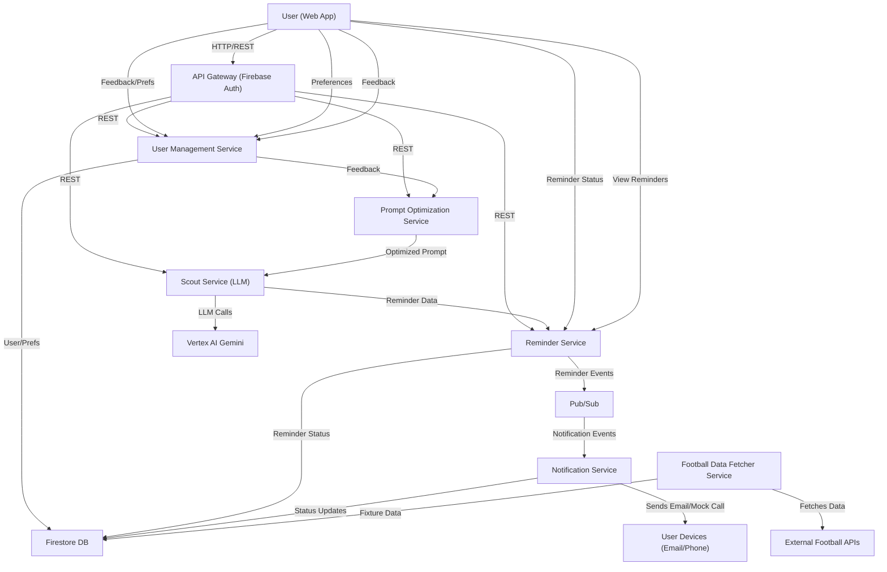

# Fixture Scout AI

**Fixture Scout AI** is an AI-powered microservice platform that delivers personalized football match reminders to fans. By leveraging LLMs (Google Vertex AI Gemini), user preferences, and real-time football data, it ensures you never miss a match that matters to you.

---

## What is Fixture Scout AI?

Fixture Scout AI is a cloud-native, end-to-end system that:
- Lets users specify their football match interests in natural language.
- Optimizes these preferences using an LLM for precise match selection.
- Fetches real-world football fixtures.
- Uses another LLM to select relevant matches and generate personalized reminders.
- Schedules and sends reminders via email or mock phone calls.
- Continuously improves through user feedback.

---

## Architecture Diagram



---

## Microservice Descriptions

- **Frontend (fixture-scout-ui):**  
  React + Material UI web app for user sign-up, preferences, reminders, and feedback. Auth via Firebase.

- **API Gateway:**  
  Google Cloud Endpoints (ESPv2) with OpenAPI spec, authenticates users (Firebase) and routes requests to backend services.

- **User Management Service:**  
  Manages user profiles, preferences, and feedback. Handles authentication and stores user data in Firestore.

- **Prompt Optimization Service:**  
  Uses Vertex AI Gemini to convert raw user preferences into clear, actionable prompts for the Scout Service.

- **Scout Service:**  
  The “brain” of the system. Uses Vertex AI Gemini to select relevant matches for each user and generate reminder details, based on optimized prompts and user feedback.

- **Reminder Service:**  
  Schedules reminders, publishes events to Pub/Sub, and updates reminder statuses.

- **Notification Service:**  
  Consumes Pub/Sub events, sends (mock) email/phone notifications, and logs status updates.

- **Football Data Fetcher Service:**  
  Periodically fetches real football fixtures from external APIs and stores them in Firestore.

---

## How It Works: End-to-End Flow

1. **User Onboarding:**  
   User signs up via the web app (Firebase Auth). Profile is created in Firestore.

2. **Preference Input:**  
   User enters football interests in natural language (e.g., “I love Real Madrid and Champions League finals”).

3. **Prompt Optimization:**  
   The Prompt Optimization Service refines the user’s input into a structured, LLM-friendly prompt.

4. **Fixture Fetching:**  
   The Football Data Fetcher Service pulls upcoming fixtures from external APIs and stores them.

5. **Match Selection & Reminder Generation:**  
   The Scout Service uses the optimized prompt, fixture data, and recent user feedback to select matches and generate personalized reminders (with timing, mode, and custom messages).

6. **Reminder Scheduling:**  
   The Reminder Service schedules reminders and publishes events to Pub/Sub.

7. **Notification Delivery:**  
   The Notification Service sends out reminders (email or mock phone call) and logs delivery status.

8. **User Feedback Loop:**  
   Users can provide feedback on reminders, which is used to further refine future match selection.

---

## Tech Stack + Services

- **Frontend:** React, Material UI, Firebase Auth, Vite
- **API Gateway:** Google Cloud Endpoints (ESPv2), OpenAPI
- **Backend:** Python (FastAPI), Google Cloud Run, Firestore, Pub/Sub
- **LLM:** Google Vertex AI Gemini (for both prompt optimization and match selection)
- **CI/CD & Infra:** Docker, gcloud, shell scripts

---

## Setup Instructions

### Local Development

1. **Clone the repo:**  
   `git clone <repo-url> && cd fixture-scout-ai`

2. **Set up Python services:**  
   - Create and activate a virtualenv in each service directory.
   - Install dependencies: `pip install -r requirements.txt`
   - Copy `.env.example` to `.env` and fill in required values.

3. **Frontend:**  
   - `cd frontend/fixture-scout-ui`
   - `npm install`
   - `npm run dev`

4. **Emulators:**  
   - Use the scripts in `tools/emulator/` to run local Pub/Sub and Firestore emulators if needed.

### Docker Compose (local, if available)

- (If a `docker-compose.yml` is present, run `docker-compose up`.)

### Deploy to Google Cloud

Each service has a `cloud_run_deploy.sh` script. Example for the Scout Service:

```bash
cd scout_service
./cloud_run_deploy.sh
```

- Ensure you have set up Artifact Registry, enabled Cloud Run, Firestore, Pub/Sub, and have the correct IAM roles.
- Use the scripts in `tools/gcp/` to set up Pub/Sub topics, Cloud Scheduler jobs, and service accounts.

### API Gateway

- Use `api_gateway/deploy_endpoints_svc_config.sh` to deploy the OpenAPI spec and configure routing/auth.

---

## LLM Prompt Format + Feedback Loop

- **Prompt Optimization:**  
  User’s raw preferences are sent to the Prompt Optimization Service, which uses an LLM to generate a clear, actionable prompt for match selection.

- **Match Selection Prompt:**  
  The Scout Service constructs a prompt for Gemini that includes:
  - The optimized user prompt.
  - A list of upcoming fixtures (as JSON).
  - Recent negative feedback (matches the user didn’t like, with reasons).

- **LLM Output:**  
  Gemini returns a JSON array of selected matches, each with:
  - `fixture_id`
  - `reason`
  - `importance_score` (1-5)
  - `reminder_triggers` (timing, mode, custom message)

- **Feedback Loop:**  
  Users can mark reminders as “not interested” and provide reasons. This feedback is stored and included in future prompts to the LLM, helping it avoid similar unwanted matches.

---

## Limitations / What’s Not Done

- **Notification Service:**  
  Currently uses mock email/phone call senders. Real integrations (e.g., Twilio, SendGrid) are not implemented.
- **LLM Output Validation:**  
  Assumes Gemini returns valid JSON; more robust error handling may be needed.
- **Scalability:**  
  Firestore and Pub/Sub are used, but very high user/fixture volumes may require further optimization.
- **Admin/Monitoring UI:**  
  No admin dashboard for monitoring reminders, feedback, or system health.
- **Testing:**  
  Automated tests and CI/CD pipelines are not included.
- **Security:**  
  Ensure all secrets are managed securely (e.g., Secret Manager in production).
- **Internationalization:**  
  Only English is supported in prompts and messages.

---

## Contributions / Feedback Welcome

We welcome issues, feature requests, and pull requests!  
If you have ideas for new features, improvements, or want to help with real notification integrations, monitoring, or testing, please open an issue or PR.

---

**Fixture Scout AI** is built to help fans never miss a match that matters.  
Let’s make it even better—together!
